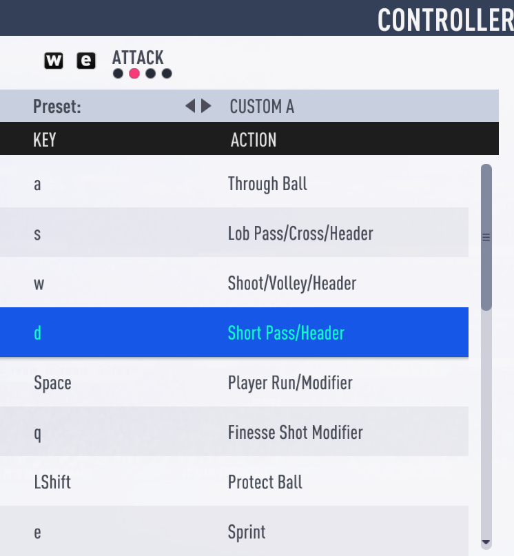
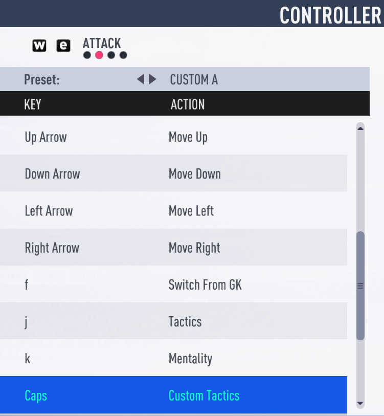
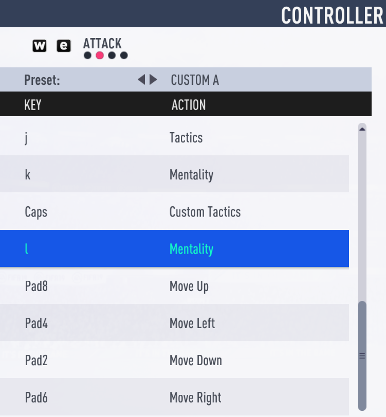
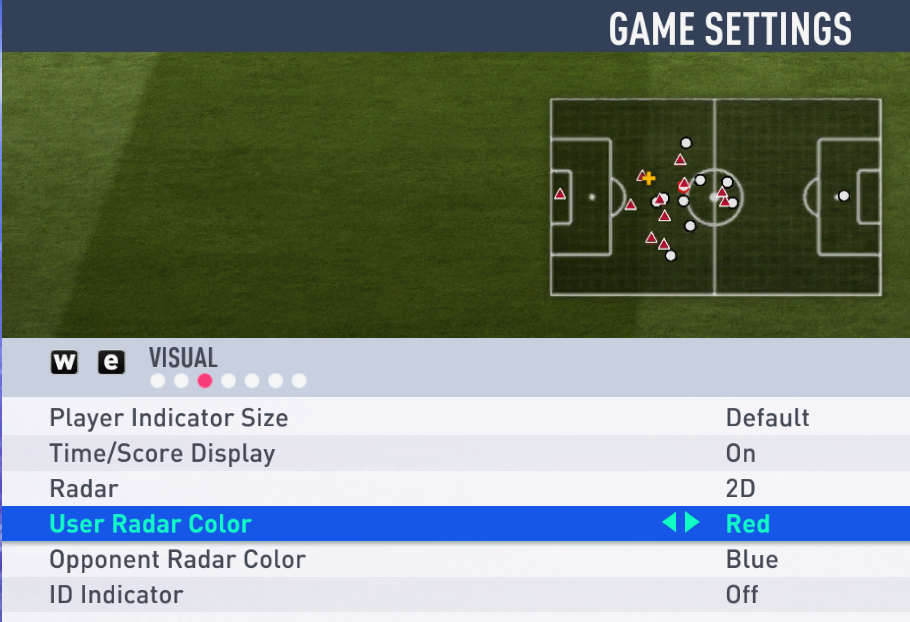

# FifaBot

<!--suppress HtmlDeprecatedAttribute -->

The repository contains an AI bot for the game Fifa19, but this approach will work for others as well
FIFA series games. The bot analyzes the 2D layout of the field (it must be turned on) to evaluate the game
situations, then makes decisions and triggers keyboard events to control the game process.
The bot is written without using third-party libraries like OpenCV, only dependencies are included
for testing and code generation.

Read this in other languages: 

[Eng](./README.md)

[Rus](./README.ru.md)

### How to run

###### Startup requirements: `java 17+`

###### Run from the project directory: `gradlew run`

###### Extra options:

1. `-logging` - all screenshots will be placed in _**USER_HOME/logs/TestImages**_, the log will be written to _**logs/fifa_bot.log**_
2. `-replayer` - the application will be launched in **_Replayer_** mode
3. `-production` - any logs will be disabled in the application
4. `-visual-log` - will create a merged image with an overlaid log in `USER_HOME/logs/TestImages`. See [ImageLogProducer](src/main/java/org/bot/debug/ImageLogProducer.java)

>:question: **_Note:_** The bot can be launched as an .exe file (self-extracting archive compiled using jlink), downloaded in the Releases tab

>:warning: **_Important:_** The bot is configured to work in 1920x1080 resolution with 100% scaling

### List of modules

  
Collapse/Expand

[Main](src/main/java/org/bot/Main.java) - entry point for the application, creation and initialization of basic objects

[ImageAnalysis](src/main/java/org/bot/ImageAnalysis.java) - the class analyzes the image of the field diagram

[GeometryUtils](src/main/java/org/bot/utils/GeometryUtils.java)- class provides helper
methods for 2D geometry

[ImageUtils](src/main/java/org/bot/utils/ImageUtils.java) - the class provides helper methods for
serialization/deserialization of game state to/from `.dat` file, getting image pixel color,
methods for organizing replay analysis, etc.

[GameInfo](src/main/java/org/bot/GameInfo.java) - data class that stores information about the current game
situations - coordinates of players, ball, active player, etc.

[GameHistory](src/main/java/org/bot/GameHistory.java) - class stores previous game states
and previous decisions

[GameAction](src/main/java/org/bot/GameAction.java) - class responsible for creating a game
actions (pass, hit, move, etc.)

[DecisionMaker](src/main/java/org/bot/DecisionMaker.java) - the class is responsible for making the best decision on
based on data from [`GameInfo`](src/main/java/org/bot/GameInfo.java)

[ActionProducer](src/main/java/org/bot/ActionProducer.java) - the class is responsible for generating device events
input. Currently only keyboard is available

[ImageLogProducer](src/main/java/org/bot/debug/ImageLogProducer.java) - the class creates a `full_game.png` image
displaying a visual log of the game. This is necessary for 
debugging purposes and analysis of the "replay" from `USER_HOME/logs/TestImages`

[ColorsEnum](src/main/java/org/bot/enums/ColorsEnum.java) - listing the color ranges for which
objects are identified during image analysis

[ControlsEnum](src/main/java/org/bot/enums/ColorsEnum.java) - listing possible game actions and their groups

[GameConstantsEnum](src/main/java/org/bot/enums/GameConstantsEnum.java) - stores static information
unchangeable over time (coordinates of the center of the field, penalty area, initial delay of actions, etc.)

[GeomEnum](src/main/java/org/bot/enums/GeomEnum.java) - stores auxiliary enumerations for defining directions

### How it works

  
Collapse/Expand

The main game loop starts and the bot takes a screenshot of the field as `BufferedImage`, for example:soccer::

    

The bot analyzed the screenshot and received the following information:

    playmates=[       opposites=[       activePlayer=[x=33,y=63] 
      [x=65,y=6]        [x=134,y=23]    ball=[x=36,y=64]
      [x=108,y=7]       [x=165,y=35]    isPlaymateBallPossession=true
      [x=117,y=49]      [x=165,y=61]    isShadingField=false
      [x=65,y=53]       [x=92,y=65]     isNobodyBallPossession=false
      [x=33,y=63]       [x=155,y=65]    playmateSide=LEFT_PLAYMATE_SIDE
      [x=140,y=67]      [x=214,y=73]
      [x=106,y=72]      [x=165,y=77]
      [x=82,y=94]       [x=141,y=81]
      [x=53,y=96]       [x=104,y=86]
      [x=65,y=134]      [x=165,y=103]
      [x=108,y=134]]    [x=138,y=118]]

Based on this information, a set of suitable actions was identified:

    [
      [
         controls=[MOVE_UP, MOVE_RIGHT, ATTACK_SHORT_PASS_HEADER],
         actionTargetPlayer=[x=65,y=53]
      ],
      [
         controls=[MOVE_RIGHT],
         actionTargetPlayer=[x=33,y=63]
      ], 
      [
         controls=[ATTACK_PROTECT_BALL],
         actionTargetPlayer=[x=33,y=63]
      ]
    ]

From a set of actions, the bot selects the highest priority:

    [
       controls=[MOVE_UP, MOVE_RIGHT, ATTACK_SHORT_PASS_HEADER],
       actionTargetPlayer=[x=65,y=53]
    ]

After executing the action, we get a new state:soccer::

    

The bot performed the action correctly - gave a pass to the player who was in the upper right corner from
active player in the previous screenshot, then the cycle repeats.

### Example log and debugging

  
Collapse/Expand

This is what part of the log looks like with the described states:file_folder::

    

For the purpose of debugging and analyzing the behavior of the bot, a class was written
[ImageLogProducer](src/main/java/org/bot/debug/ImageLogProducer.java)
allowing you to link a text log with an image of the game state.

An example of a visual log for the states described above:mag_right::

    

>:warning: **_Important:_** The `USER_HOME/logs/TestImages` folder should contain quite limited
> the number of images corresponding to a certain game interval, otherwise for
> [ImageLogProducer](src/main/java/org/bot/debug/ImageLogProducer.java) may not be enough
> RAM create too long final image

### Managing and setting up the game client

The bot uses the following gameplay control scheme:wrench::

  
Collapse/Expand

**_SPRINT_** - `VK_E`

**_MOVE_UP_** - `VK_UP`

**_MOVE_DOWN_** - `VK_DOWN`

**_MOVE_LEFT_** - `VK_LEFT`

**_MOVE_RIGHT_** - `VK_RIGHT`

**_MOVE_UP_PAD_** - `VK_NUMPAD8`

**_MOVE_DOWN_PAD_** - `VK_NUMPAD2`

**_MOVE_LEFT_PAD_** - `VK_NUMPAD4`

**_MOVE_RIGHT_PAD_** - `VK_NUMPAD6`

**_TACTICS_** - `VK_J`

**_MENTALITY_LEFT_** - `VK_K`

**_MENTALITY_RIGHT_** - `VK_L`

**_CUSTOM_TACTICS_** - `VK_CAPS_LOCK`

**_SWITCH_FROM_GK_** - `VK_F`

**_ATTACK_THROUGH_BALL_** - `VK_A`

**_ATTACK_LOB_PASS_CROSS_HEADER_** - `VK_S`

**_ATTACK_SHOOT_VOLLEY_HEADER_** - `VK_W`

**_ATTACK_SHORT_PASS_HEADER_** - `VK_D`

**_ATTACK_PLAYER_RUN_MODIFIER_** - `VK_SPACE`

**_ATTACK_FINESSE_SHOT_MODIFIER_** - `VK_Q`

**_ATTACK_PROTECT_BALL_** - `VK_SHIFT`

**_DEFENCE_RUSH_GK_** - `VK_A`

**_DEFENCE_SLIDING_TACKLE_** - `VK_S`

**_DEFENCE_TACKLE_PUSH_OR_PULL_** - `VK_W`

**_DEFENCE_CONTAIN_** - `VK_D`

**_DEFENCE_CHANGE_PLAYER_** - `VK_SPACE`

**_DEFENCE_TEAMMATE_CONTAIN_** - `VK_Q`

**_DEFENCE_JOCKEY_** - `VK_SHIFT`

**_CHIP_SHOT_** - `VK_SPACE + VK_W`

**_FINESSE_SHOT_** - `VK_Q + VK_W`

**_LOW_SHOT_** - `VK_SPACE + VK_Q + VK_W`

**_THREADED_THROUGH_PASS_** - `VK_Q + VK_A`

**_LOBBED_THROUGH_PASS_** - `VK_SPACE + VK_A`

**_DRIVEN_LOB_PASS_CROSS_** - `VK_Q + VK_S`

**_HIGH_LOB_CROSS_** - `VK_SPACE + VK_S`

**_LOW_CROSS_** - `VK_S + VK_S`

**_SCOOP_LOB_** - `VK_SHIFT + VK_S`

**_CANCEL_** - `VK_SHIFT + VK_E`

**_FLAIR_PASS_** - `VK_SHIFT + VK_D`

**_FLAIR_SHOOT_** - `VK_SHIFT + VK_W`

**_DRIVEN_GROUND_PASS_** - `VK_Q + VK_D`

**_RUNNING_JOCKEY_** - `VK_SHIFT + VK_E`

You need to create the appropriate configuration in the game client:video_game::

  
Collapse/Expand

    

      
    

    

      
    

    

      
    

The 2D field layout must be turned on and the players' colors must be `red` - for you,
`blue` - for the enemy, control device - `Keyboard only`,
FullHD resolution, 100% scaling:computer::

  
Collapse/Expand

    

        
    

### Gameplay
Difficulty level - beginner

  
Collapse/Expand

  

    
  

