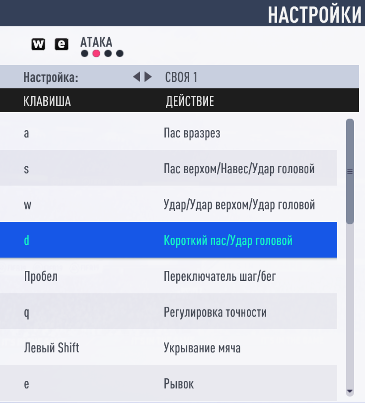

# FifaBot

<!--suppress HtmlDeprecatedAttribute -->

Репозиторий содержит AI бота для игры Fifa19, но данный подход сработает и для других
игр серии fifa. Бот анализирует 2D-схему поля(она должна быть включена) для оценки игровой
ситуации, затем принимает решение и инициирует события клавиатуры для управления процессом игры.

Читайте это на других языках:

[Eng](./README.md)

[Rus](./README.ru.md)

### Как запускать

###### Требования для запуска: `java 17+`

###### Из директории проекта запустить: `gradlew run`

###### Дополнительные параметры: `-logging` `-replayer`

1. `-logging` - все скриншоты будут помещены _**USER_HOME/logs/TestImages**_, лог будет записан в _**logs/fifa_bot.log**_
2. `-replayer` - приложение будет запущено в режиме **_Реплеера_**

>:warning: **_Важно:_** Бот настроен на работу в разрешении 1920x1080 при масштабировании 100%

### Список модулей

  
Свернуть/Развернуть

[Main](src/main/java/org/bot/Main.java) - точка входа для приложения, создание и инициализация базовых объектов

[ImageAnalysis](src/main/java/org/bot/ImageAnalysis.java) - класс производит анализ изображения схемы поля

[GeometryUtils](src/main/java/org/bot/utils/GeometryUtils.java)- класс предоставляет вспомогательные
методы для 2D геометрии

[ImageUtils](src/main/java/org/bot/utils/ImageUtils.java) - класс предоставляет вспомогательные методы для
сериализации/десериализации игрового состояния в/из `.dat` файла, получение цвета пикселя изображения,
методы для организации анализа реплея и тп.

[GameInfo](src/main/java/org/bot/GameInfo.java) - класс данных который хранит информацию о текущей игровой
ситуации - координаты игроков, мяча, активного игрока и тп.

[GameHistory](src/main/java/org/bot/GameHistory.java) - класс хранит предыдущие состояния игры
и ранее принятые решения

[GameAction](src/main/java/org/bot/GameAction.java) - класс отвечающий за создание игрового
действия(пас, удар, перемещение и тп.)

[DecisionMaker](src/main/java/org/bot/DecisionMaker.java) - класс отвечает за принятия лучшего решения на
основе данных из [`GameInfo`](src/main/java/org/bot/GameInfo.java)

[ActionProducer](src/main/java/org/bot/ActionProducer.java) - класс отвечает за генерацию событий устройств
ввода. Сейчас доступна только клавиатура

[ImageLogProducer](src/main/java/org/bot/debug/ImageLogProducer.java) - класс создает `full_game.png` изображение
отображающее визуальный лог игры. Это необходимо для целей отладки и анализа "реплея" из `USER_HOME/logs/TestImages`

[ColorsEnum](src/main/java/org/bot/enums/ColorsEnum.java) - перечисление цветовых диапазонов по которым
определяются объекты в ходе анализа изображения

[ControlsEnum](src/main/java/org/bot/enums/ColorsEnum.java) - перечисление возможных игровых действий и их групп

[GameConstantsEnum](src/main/java/org/bot/enums/GameConstantsEnum.java) - хранит статическую информацию
неизменяемую со временем(координаты центра поля, штрафной площади, начальная задержка действий и тп.)

[GeomEnum](src/main/java/org/bot/enums/GeomEnum.java) - хранит вспомогательные перечисления для определения направлений

### Как это работает

  
Свернуть/Развернуть

Стартует главный цикл игры и бот делает скриншот поля как `BufferedImage`, например:soccer::

    

Бот анализировал скриншот и получил следующую информацию:

    playmates=[       opposites=[       activePlayer=[x=33,y=63] 
      [x=65,y=6]        [x=134,y=23]    ball=[x=36,y=64]
      [x=108,y=7]       [x=165,y=35]    isPlaymateBallPossession=true
      [x=117,y=49]      [x=165,y=61]    isShadingField=false
      [x=65,y=53]       [x=92,y=65]     isNobodyBallPossession=false
      [x=33,y=63]       [x=155,y=65]    playmateSide=LEFT_PLAYMATE_SIDE
      [x=140,y=67]      [x=214,y=73]
      [x=106,y=72]      [x=165,y=77]
      [x=82,y=94]       [x=141,y=81]
      [x=53,y=96]       [x=104,y=86]
      [x=65,y=134]      [x=165,y=103]
      [x=108,y=134]]    [x=138,y=118]]

На основе этой информации был определен набор подходящих действий:

    [
      [
         controls=[MOVE_UP, MOVE_RIGHT, ATTACK_SHORT_PASS_HEADER],
         actionTargetPlayer=[x=65,y=53]
      ],
      [
         controls=[MOVE_RIGHT],
         actionTargetPlayer=[x=33,y=63]
      ], 
      [
         controls=[ATTACK_PROTECT_BALL],
         actionTargetPlayer=[x=33,y=63]
      ]
    ]

Из набора действий бот выбирает наиболее приоритетное:

    [
       controls=[MOVE_UP, MOVE_RIGHT, ATTACK_SHORT_PASS_HEADER],
       actionTargetPlayer=[x=65,y=53]
    ]

После выполнения действия мы получаем новое состояние:soccer:: 

    

Бот правильно выполнил действие - отдал пас игроку который находился в правом верхнем углу от 
активного игрока на предыдущем скриншоте, далее цикл повторяется.

### Пример лога и отладка

  
Свернуть/Развернуть

Так выглядит часть лога с описанными состояниями:file_folder::

    

В целях отладки и анализа поведения бота был написан класс 
[ImageLogProducer](src/main/java/org/bot/debug/ImageLogProducer.java)
позволяющий связать текстовый лог с изображением состояния игры. 

Пример визуального лога для описанных выше состояний:mag_right::

    

>:warning: **_Важно:_** В папке `USER_HOME/logs/TestImages` должно быть довольно ограниченное
> количество изображений соответсвующее определенному интервалу игры, иначе для
> [ImageLogProducer](src/main/java/org/bot/debug/ImageLogProducer.java) может не хватить 
> оперативной памяти создать слишком "длинное" итоговое изображение  

### Управление и настройка клиента игры

Бот использует следующую схему управления игровым процессом:wrench::

  
Свернуть/Развернуть

**_РЫВОК_** - `VK_E`

**_ПЕРЕМЕЩЕНИЕ_ВВЕРХ_** - `VK_UP`

**_ПЕРЕМЕЩЕНИЕ_ВНИЗ_** - `VK_DOWN`

**_ПЕРЕМЕЩЕНИЕ_ВЛЕВО_** - `VK_LEFT`

**_ПЕРЕМЕЩЕНИЕ_ВПРАВО_** - `VK_RIGHT`

**_ПЕРЕМЕЩЕНИЕ_ВВЕРХ_ЦИФР_** - `VK_NUMPAD8`

**_ПЕРЕМЕЩЕНИЕ_ВНИЗ_ЦИФР_** - `VK_NUMPAD2`

**_ПЕРЕМЕЩЕНИЕ_ВЛЕВО_ЦИФР_** - `VK_NUMPAD4`

**_ПЕРЕМЕЩЕНИЕ_ВПРАВО_ЦИФР_** - `VK_NUMPAD6`

**_ТАКТИКА_** - `VK_J`

**_НАСТРОЙ_ВЛЕВО_** - `VK_K`

**_НАСТРОЙ_ВПРАВО_** - `VK_L`

**_СВОЯ_ТАКТИКА_** - `VK_CAPS_LOCK`

**_ПЕРЕКЛЮЧИТЬСЯ_НА_ВРАТАРЯ_** - `VK_F`

**_ПАС_В_РАЗРЕЗ_** - `VK_A`

**_ПАС_ВЕРХНОМ/НАВЕС/УДАР_ГОЛОВОЙ_** - `VK_S`

**_УДАР/УДАР_ВЕРХНОМ/УДАР_ГОЛОВОЙ_** - `VK_W`

**_КОРОТКИЙ_ПАС/УДАР_ГОЛОВОЙ_** - `VK_D`

**_ПЕРЕКЛЮЧАТЕЛЬ_ШАГ/БЕГ_** - `VK_SPACE`

**_РЕГУЛИРОВКА_ТОЧНОСТИ_** - `VK_Q`

**_УКРЫВАНИЯ_МЯЧА_** - `VK_SHIFT`

**_ВЫХОД_ВРАТАРЯ(УДЕРЖИВАТЬ)_** - `VK_A`

**_ПОДКАТ_** - `VK_S`

**_ОТБОР_МЯЧА/ТОЛКНУТЬ/ПРИДЕРЖАТЬ_** - `VK_W`

**_СДЕРЖИВАНИЕ_** - `VK_D`

**_СМЕНА_ИГРОКА_** - `VK_SPACE`

**_СДЕРЖИВАНИЕ_ПАРТНЕРОМ_** - `VK_Q`

**_ОБОРОНА_** - `VK_SHIFT`

**_"ПАРАШЮТ"_** - `VK_SPACE + VK_W`

**_ТОЧНЫЙ_УДАР_** - `VK_Q + VK_W`

**_УДАР_НИЗОМ/УДАР_ГОЛОВОЙ_В_НИЗ_ВОРОТ_** - `VK_SPACE + VK_Q + VK_W`

**_ЮВЕЛИРНЫЙ_ПАС_ВРАЗРЕЗ_** - `VK_Q + VK_A`

**_ПАС_ВЕРХНОМ_ВРАЗРЕЗ_** - `VK_SPACE + VK_A`

**_МОЩНЫЙ_ПАС_ВЕРХНОМ/НАВЕС_** - `VK_Q + VK_S`

**_ВЫСОКИЙ_ПАС_ВЕРХНОМ/НАВЕС_** - `VK_SPACE + VK_S`

**_ПРОСТРЕЛ_** - `VK_S + VK_S`

**_ПАС_ВЕРХНОМ_ЧЕРПАЧКОМ_** - `VK_SHIFT + VK_S`

**_ИЗЯЩНЫЙ_ПАС_** - `VK_SHIFT + VK_D`

**_ИЗЯЩНЫЙ_УДАР_** - `VK_SHIFT + VK_W`

**_МОЖЩНЫЙ_ПАС_НИЗОМ_** - `VK_Q + VK_D`

**_ОТМЕНА_** - `VK_SHIFT + VK_E`

**_ДРИБЛИНГ_ВСЛЕПУЮ_** - `VK_SHIFT + VK_E`

Необходимо создать соответствующую конфигурацию в клиенте игры:video_game::

  
Свернуть/Развернуть

  

    
  

  

    
  

  

    
  

Должна быть включена 2D-cхема поля и выбраны цвета игроков `красный` - для вас,
`синий` - для противника, устройство управления - `Только клавиатура`, 
разрешение FullHD, масштабирование 100%:computer::

  
Свернуть/Развернуть

  

    
  

